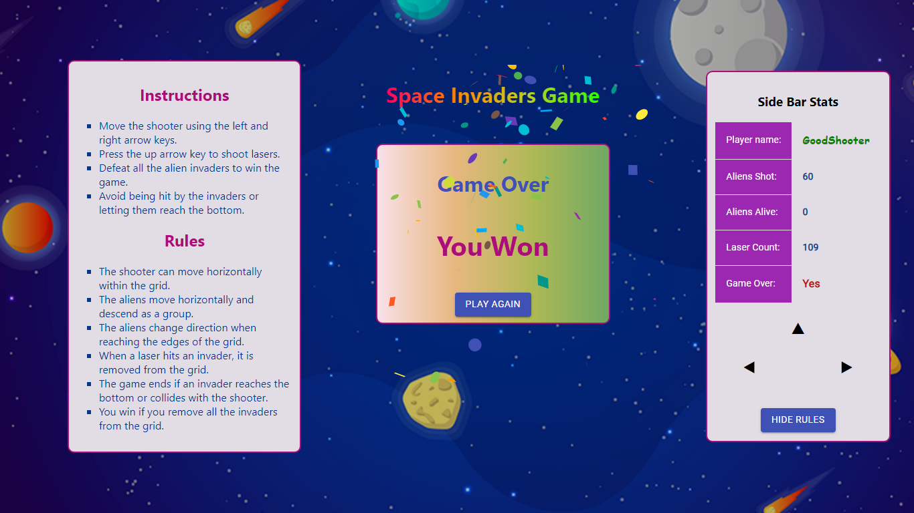

# Project Showcase: `Space Invaders`

# How to install and run the project
In the project directory, you can run:
### `npm install`
### `npm start`

## Overview

The game makes use of an avatar character that can be controlled using arrow keys or 'wasd' keys within the game environment. The game includes collectible items to gather points and features a game-ending condition, such as encountering monsters or colliding with obstacles. 

## Technologies Used

- **React:** For building user interfaces, often used for creating dynamic and interactive web applications
- **CSS:** Custom styling for the overall appearance.
- **Redux:** For state management.
- **Jest:** For testing the functionality of the app.

## Contact

For any inquiries or questions, feel free to reach out to Tshediso at [tshedisoboshiana@gmail.com](mailto:tshedisoboshiana@gmail.com).

Other projects can be found at [projects](https://projects-5584f.web.app/)

Happy exploring! 🚀